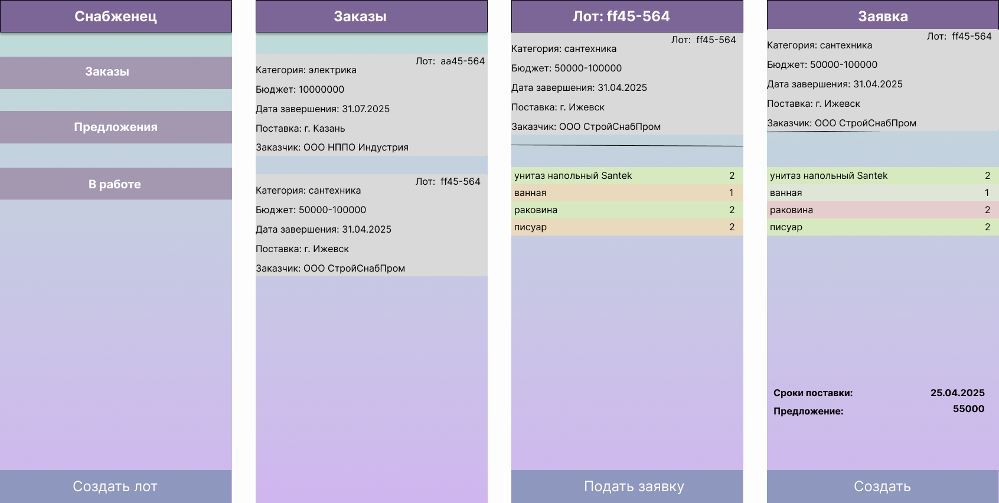

## Преамбула

Сколько событий вокруг нас остается незамеченными:
- в спортзале проводится бесплатное занятие по йоге
- в соседнем сквере местная рок-группа проведет небольшой концерт
- в торговом центре организуется мастер-класс по плетению браслетов
- у соседнего подъезда будут высаживать цветы, можно покопаться в земле

Что делать, если
- захотел поиграть в шахматы, но не знаешь с кем
- решил прогуляться в парке, но друзья все уехали из города
- приехал в командировку и не знаешь куда пойти в выходной
- есть возможность съездить на пару-тройку дней в небольшой отпуск, но надо решить куда пойти

"ВстречаемсяЗдесь" -- интерактивная карта с элементами соц.сети, с помощью которой можно организовать самому или найти 
интересные места и события в зависимости от места нахождения, даты/времени пребывания, пола/возраста и других фильтров.

Задача карты:
* для участников - упросить поиск информации, иметь возможность подбирать по разным фильтрам подходящие для себя события  
* для организаторов - иметь простую возможность предоставить информацию о себе, привлечь участников/клиентов  

## Визуальная схема фронтенда

https://www.figma.com/design/E1UH3sInqlHFuY9bkVDJWV/meethere?node-id=1-6&t=cFHAkWaDBFYczICZ-1
## Документация

1. Маркетинг и аналитика
    1. [Целевая аудитория](./docs/01-biz/01-target-audience.md)
    2. [Заинтересанты](./docs/01-biz/02-stakeholders.md)
    3. [Пользовательские истории](./docs/01-biz/03-bizreq.md)
    4. [Конкуренты](./docs/01-biz/04-competitors.md) 
2. Аналитика:
    1. [Функциональные требования](./docs/02-analysis/01-functional-requiremens.md)
    2. [Нефункциональные требования](./docs/02-analysis/02-nonfunctional-requirements.md)
3. DevOps
4. Архитектура
    1. [ADR](./docs/04-architecture/01-adrs/ADR.md)
    2. [C4](./docs/04-architecture/02-c4/C4.md)
    2. [Описание API](./docs/04-architecture/02-api.md) TODO
    3. [Компонентная схема](./docs/04-architecture/03-arch.md) TODO
5. Тесты

# Структура проекта

TODO