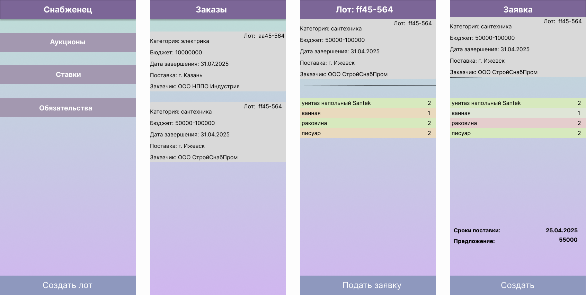

# supplier

"Снабженец" -- торговая площадка, для организации конкурсов на закупку строительных материалов в Приволжским федеральным округе. 
В отличие от обычных аукционов, заказчик может в любой момент выбрать понравившееся предложение по соотношению цена/качество/время 
доставки. Для подрядчиков есть возможность выставить несколько предложений на один лот с разными ценами и сроками.   

Задача площадки:
* для заказчиков - уменьшить стоимость/улучшить качество поставляемых товаров/увеличить сроки поставки за счет увеличения количества предложений
* для подрядчиков - увеличить количество возможных покупателей/увеличить объемы продаж 

## Визуальная схема фронтенда

https://www.figma.com/design/E1UH3sInqlHFuY9bkVDJWV/supplier?node-id=1-6&t=etGltWC8rXDxjPzU-1

## Документация

1. Маркетинг и аналитика
    1. [Целевая аудитория](./docs/01-biz/01-target-audience.md)
    2. [Заинтересанты](./docs/01-biz/02-stakeholders.md)
    3. [Пользовательские истории](./docs/01-biz/03-bizreq.md)
2. Аналитика:
    1. [Функциональные требования](./docs/02-analysis/01-functional-requiremens.md)
    2. [Нефункциональные требования](./docs/02-analysis/02-nonfunctional-requirements.md)
3. DevOps
4. Архитектура
    1. [ADR](./docs/04-architecture/01-adrs.md)
    2. [Описание API](./docs/04-architecture/02-api.md)
    3. [Компонентная схема](./docs/04-architecture/03-arch.md)
5. Тесты

# Структура проекта

TODO